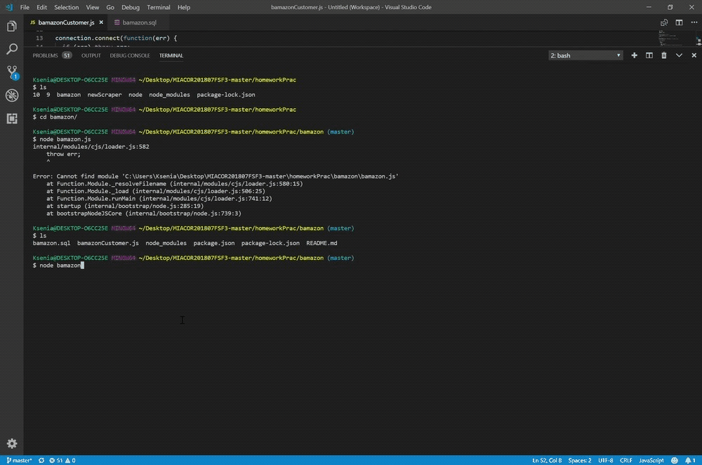

# bamazon

I created an Amazon-like storefront with MySQL. The app takes in orders from customers and deplete stock from the store's inventory.

Technologies: Javascript, MySQL

The Node application shows a table with id,  products, price, quantity. User should answer for inquerer questions to make a chose. As a result the app shows a total cost of purchase.
